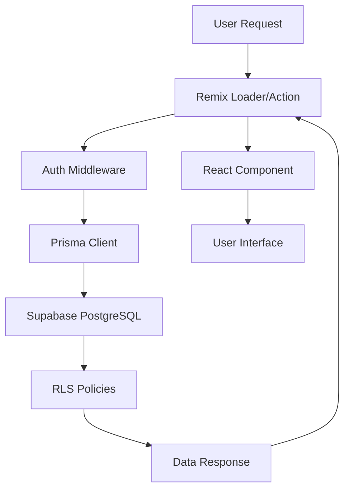

# 🏗️ Arquitectura Técnica - Lawyer Platform

## 📋 Índice
1. [Visión General](#visión-general)
2. [Stack Tecnológico](#stack-tecnológico)
3. [Arquitectura de Datos](#arquitectura-de-datos)
4. [Flujos de Sistema](#flujos-de-sistema)
5. [Seguridad](#seguridad)
6. [Performance](#performance)
7. [Escalabilidad](#escalabilidad)

## 🎯 Visión General

### Concepto de Arquitectura

**Lawyer Platform** es una aplicación **full-stack serverless** construida con arquitectura **JAMstack moderna**, optimizada para:

- **Escalabilidad automática** sin gestión de servidores
- **Performance global** con Edge Computing
- **Desarrollo rápido** con TypeScript end-to-end
- **Seguridad por diseño** con validación en múltiples capas

### Principios de Diseño

1. **API-First**: Todas las funcionalidades expuestas como APIs reutilizables
2. **Type Safety**: TypeScript desde frontend hasta base de datos
3. **Progressive Enhancement**: Funciona sin JavaScript, mejor con JavaScript
4. **Security by Default**: Autenticación, autorización y validación en cada layer
5. **Developer Experience**: Hot reloading, type checking, debugging tools

## 🛠️ Stack Tecnológico

### Frontend Stack

```typescript
// Stack de presentación
├── Remix (React + SSR)
│   ├── React 18 con Server Components
│   ├── Nested Routing
│   ├── Progressive Enhancement
│   └── Built-in Error Boundaries
├── TailwindCSS
│   ├── Utility-first CSS
│   ├── JIT Compilation
│   ├── Custom Design System
│   └── Responsive Design
├── Framer Motion
│   ├── Declarative Animations
│   ├── Gesture Recognition
│   └── Layout Animations
└── TypeScript
    ├── Strict Type Checking
    ├── Interface Definitions
    └── Auto-completion
```

### Backend Stack

```typescript
// Stack de servidor
├── Remix (Server-Side)
│   ├── Loader Functions (Data Fetching)
│   ├── Action Functions (Mutations)
│   ├── Middleware Support
│   └── Session Management
├── Prisma ORM
│   ├── Type-safe Database Client
│   ├── Auto-generated Types
│   ├── Migration System
│   └── Connection Pooling
├── Supabase (PostgreSQL)
│   ├── Managed PostgreSQL
│   ├── Real-time Subscriptions
│   ├── Row Level Security (RLS)
│   └── Storage para archivos
└── External APIs
    ├── Gemini AI (Google)
    ├── Wompi (Pagos)
    └── Email Services
```

### Infrastructure Stack

```typescript
// Infraestructura serverless
├── Vercel (Hosting)
│   ├── Edge Functions
│   ├── Automatic Deployments
│   ├── Preview Environments
│   └── Analytics
├── Supabase (Backend)
│   ├── Database Hosting
│   ├── Authentication
│   ├── File Storage
│   └── Edge Functions
└── CDN & Performance
    ├── Global Edge Network
    ├── Image Optimization
    ├── Asset Compression
    └── Caching Strategies
```

## 🗄️ Arquitectura de Datos

### Database Design Patterns

#### 1. Domain-Driven Design
```
Authentication Domain
├── Users (identidad)
├── Profiles (información personal)
├── Roles & Permissions (autorización)
└── Login Attempts (seguridad)

Legal Domain
├── Lawyers (profesionales)
├── Legal Areas (conocimiento)
├── AI Cache (performance)
└── Consultations (historiales)

Business Domain
├── Licenses (productos)
├── Purchases (transacciones)
├── Invoices (facturación)
└── Metrics (análisis)

Communication Domain
├── Chat Sessions (conversaciones)
├── Messages (contenido)
└── Moderation (control de calidad)
```

#### 2. Data Flow Architecture



#### 3. Caching Strategy

```typescript
// Multi-layer caching
┌── Browser Cache (Static Assets)
├── CDN Cache (Global Distribution)
├── Server Cache (Computed Data)
├── Database Cache (Query Results)
└── Application Cache (AI Responses, Computed Values)
```

### Data Relationships

#### Core Entity Relationships
```sql
-- Usuario como entidad central
User ||--o{ UserLicense : "tiene"
User ||--o{ ChatSession : "participa"
User ||--o{ Purchase : "compra"
User ||--|| Profile : "posee"

-- Sistema de licencias
License ||--o{ UserLicense : "instancia"
UserLicense ||--o{ ChatSession : "consume"

-- Comunicación
ChatSession ||--o{ Message : "contiene"
ChatSession }o--|| Lawyer : "asignado"

-- Conocimiento legal
LegalArea ||--o{ LegalConsultation : "categoriza"
LegalArea ||--o{ AiResponseCache : "relacionado"
```

## 🔄 Flujos de Sistema

### 1. Flujo de Autenticación

```typescript
// Authentication Flow
┌─ User Registration ─┐
│ 1. Form Validation  │
│ 2. Email Uniqueness │
│ 3. Password Hashing │
│ 4. Profile Creation │
│ 5. Trial Assignment │
│ 6. Session Creation │
└─ Dashboard Redirect ┘

┌─ User Login ─┐
│ 1. Credential Validation │
│ 2. Attempt Logging       │
│ 3. Rate Limiting         │
│ 4. Session Creation      │
│ 5. Role-based Redirect   │
└─ Dashboard/App Access ───┘
```

### 2. Flujo de Chat con IA

```typescript
// AI Chat Flow
┌─ User Input ─┐
│ 1. License Validation    │
│ 2. Content Moderation    │
│ 3. Legal Area Detection  │
│ 4. Cache Check          │
│ 5. AI Query Generation   │
│ 6. Gemini API Call      │
│ 7. Response Processing   │
│ 8. Cache Storage        │
│ 9. Hours Consumption    │
│ 10. UI Update          │
└─ Response Display ──────┘
```

### 3. Flujo de Compra de Licencias

```typescript
// Purchase Flow
┌─ License Selection ─┐
│ 1. Catalog Display     │
│ 2. Price Calculation   │
│ 3. Coupon Validation   │
│ 4. Payment Form        │
│ 5. Wompi Integration   │
│ 6. Webhook Processing  │
│ 7. License Activation  │
│ 8. Invoice Generation  │
│ 9. Email Notification │
└─ License Access ──────┘
```

## 🔒 Seguridad

### Security Architecture

#### 1. Authentication & Authorization
```typescript
// Security Layers
┌─ Application Layer ─┐
│ • Session Management      │
│ • Role-based Access       │
│ • Input Validation        │
│ • XSS Protection         │
└─ HTTPS Transport ────────┘

┌─ Database Layer ─┐
│ • Row Level Security (RLS) │
│ • Encrypted at Rest        │
│ • Connection Encryption    │
│ • Audit Logging           │
└─ Backup Encryption ───────┘

┌─ Infrastructure Layer ─┐
│ • SSL/TLS Termination     │
│ • DDoS Protection         │
│ • WAF (Web Application Firewall) │
│ • Rate Limiting           │
└─ Security Headers ──────┘
```

#### 2. Data Protection

```typescript
// Sensitive Data Handling
interface DataClassification {
  public: string[];      // Names, general info
  internal: string[];    // User preferences, non-sensitive
  confidential: string[]; // Personal data, chat content
  restricted: string[];   // Payment info, legal documents
}

// Encryption Strategy
const encryptionMap = {
  passwords: "bcrypt + salt",
  sessions: "signed cookies",
  personalData: "AES-256-GCM",
  paymentData: "PCI DSS compliant",
  documents: "encrypted storage"
};
```

#### 3. API Security

```typescript
// API Protection Layers
export async function secureAPIRoute(request: Request) {
  // 1. Rate limiting
  await rateLimiter.check(request);
  
  // 2. Authentication
  const user = await requireUser(request);
  
  // 3. Authorization
  await checkPermissions(user, resource);
  
  // 4. Input validation
  const validatedData = await validateInput(request);
  
  // 5. Business logic
  const result = await processRequest(validatedData);
  
  // 6. Output sanitization
  return sanitizeResponse(result);
}
```

## ⚡ Performance

### Performance Architecture

#### 1. Loading Strategy
```typescript
// Progressive Loading
┌─ Critical Path ─┐
│ 1. HTML Shell (< 1KB)     │
│ 2. Critical CSS (< 14KB)  │
│ 3. Core JavaScript (< 50KB) │
└─ Interactive in < 2s ────┘

┌─ Non-Critical Assets ─┐
│ 1. Additional CSS         │
│ 2. Enhancement JavaScript │
│ 3. Images (lazy loaded)   │
│ 4. Analytics & Tracking   │
└─ Progressive Enhancement ┘
```

#### 2. Caching Strategy
```typescript
// Multi-level Caching
const cachingStrategy = {
  // Browser level
  staticAssets: "1 year",
  dynamicContent: "5 minutes",
  
  // CDN level
  images: "30 days",
  fonts: "1 year",
  
  // Server level
  userSessions: "24 hours",
  computedData: "1 hour",
  
  // Database level
  frequentQueries: "15 minutes",
  aiResponses: "7 days"
};
```

#### 3. Database Optimization
```sql
-- Performance Indexes
CREATE INDEX CONCURRENTLY idx_performance_critical ON users (email) 
WHERE status = 'active';

CREATE INDEX CONCURRENTLY idx_license_lookup ON user_licenses (user_id, status) 
WHERE status = 'active';

CREATE INDEX CONCURRENTLY idx_chat_messages ON messages (chat_session_id, created_at DESC);

-- Query Optimization
EXPLAIN (ANALYZE, BUFFERS) 
SELECT u.email, ul.hours_remaining
FROM users u
JOIN user_licenses ul ON u.id = ul.user_id
WHERE u.status = 'active' AND ul.status = 'active';
```

### Performance Metrics

```typescript
// Core Web Vitals Targets
const performanceTargets = {
  LCP: "< 2.5s",    // Largest Contentful Paint
  FID: "< 100ms",   // First Input Delay
  CLS: "< 0.1",     // Cumulative Layout Shift
  FCP: "< 1.8s",    // First Contentful Paint
  TTI: "< 3.8s"     // Time to Interactive
};

// Custom Metrics
const businessMetrics = {
  chatResponseTime: "< 3s",
  licenseValidation: "< 200ms",
  paymentProcessing: "< 5s",
  aiResponseGeneration: "< 4s"
};
```

## 📈 Escalabilidad

### Scalability Architecture

#### 1. Horizontal Scaling
```typescript
// Serverless Scaling
const scalingStrategy = {
  // Frontend
  staticSites: "Global CDN distribution",
  edgeFunctions: "Auto-scaling per region",
  
  // Backend
  apiRoutes: "Function-per-route scaling",
  database: "Connection pooling + read replicas",
  
  // Storage
  fileStorage: "Distributed object storage",
  caching: "Multi-region cache clusters"
};
```

#### 2. Database Scaling
```sql
-- Partitioning Strategy
CREATE TABLE messages_2024_q1 PARTITION OF messages
FOR VALUES FROM ('2024-01-01') TO ('2024-04-01');

-- Read Replicas
-- Configurado en Supabase para queries read-only

-- Connection Pooling
-- Prisma + PgBouncer automático en Supabase
```

#### 3. Microservices Preparation
```typescript
// Domain Boundaries (para futura separación)
const serviceBoundaries = {
  authService: ["users", "roles", "sessions"],
  licenseService: ["licenses", "purchases", "invoices"],
  chatService: ["chat_sessions", "messages", "moderation"],
  aiService: ["legal_areas", "ai_cache", "consultations"],
  notificationService: ["emails", "push", "in-app"]
};
```

### Load Testing Strategy

```typescript
// Load Testing Scenarios
const loadTests = {
  // Normal usage
  baseline: {
    users: 100,
    duration: "10m",
    rampUp: "2m"
  },
  
  // Peak usage
  stress: {
    users: 500,
    duration: "15m",
    rampUp: "5m"
  },
  
  // Extreme scenarios
  spike: {
    users: 1000,
    duration: "5m",
    rampUp: "30s"
  }
};
```

## 🔌 Integration Architecture

### External Service Integration

```typescript
// Service Integration Pattern
interface ExternalService {
  provider: string;
  authentication: "api-key" | "oauth" | "webhook";
  rateLimit: number;
  fallback: string;
  monitoring: string[];
}

const services: Record<string, ExternalService> = {
  geminiAI: {
    provider: "Google Gemini",
    authentication: "api-key",
    rateLimit: 1000, // requests per minute
    fallback: "cached_responses",
    monitoring: ["response_time", "error_rate", "quota_usage"]
  },
  
  wompiPayments: {
    provider: "Wompi",
    authentication: "api-key",
    rateLimit: 100,
    fallback: "manual_processing",
    monitoring: ["transaction_success", "webhook_delivery", "settlement_time"]
  }
};
```

### Event-Driven Architecture

```typescript
// Event System (preparado para escalabilidad)
interface DomainEvent {
  eventType: string;
  aggregateId: string;
  payload: Record<string, any>;
  timestamp: Date;
  version: number;
}

// Event Handlers
const eventHandlers = {
  "user.registered": [updateMetrics, sendWelcomeEmail, assignTrial],
  "license.purchased": [activateLicense, generateInvoice, notifyUser],
  "chat.session.ended": [calculateHours, updateMetrics, archiveMessages],
  "ai.query.processed": [cacheResponse, updateUsage, logInteraction]
};
```

## 📊 Monitoring & Observability

### Monitoring Stack

```typescript
// Observability Architecture
const monitoring = {
  // Application Performance
  apm: {
    provider: "Built-in Remix monitoring",
    metrics: ["response_time", "error_rate", "throughput"],
    alerts: ["high_error_rate", "slow_response", "service_down"]
  },
  
  // Infrastructure
  infrastructure: {
    provider: "Vercel Analytics + Supabase",
    metrics: ["cpu_usage", "memory_usage", "db_connections"],
    alerts: ["resource_exhaustion", "connection_pool_full"]
  },
  
  // Business Metrics
  business: {
    provider: "Custom dashboard",
    metrics: ["user_growth", "conversion_rate", "revenue"],
    alerts: ["conversion_drop", "payment_failures", "user_churn"]
  }
};
```

---

## 🏁 Conclusión

La arquitectura de **Lawyer Platform** está diseñada para:

1. **Escalabilidad**: Serverless + Edge computing para crecimiento automático
2. **Performance**: Multi-layer caching + optimización de queries
3. **Seguridad**: Defense in depth + compliance legal
4. **Mantenibilidad**: Type safety + clear separation of concerns
5. **Extensibilidad**: Event-driven + microservices-ready

Esta arquitectura permite evolucionar desde MVP hasta empresa scale manteniendo performance, seguridad y developer experience.

**Última actualización:** Diciembre 2024
**Versión:** 1.0
