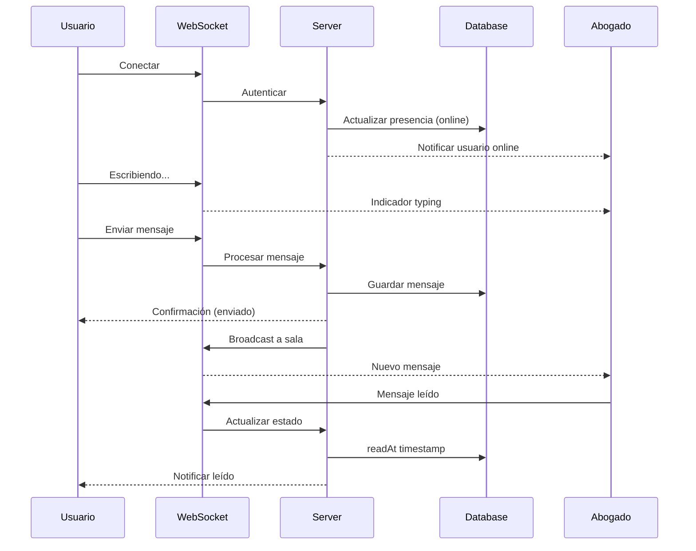
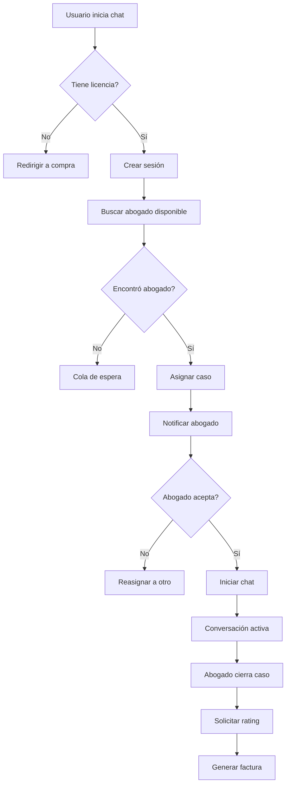

# 🗺️ Roadmap: Sistema de Notificaciones, Mensajería y Portal de Abogados

## 📊 Estado Actual del Sistema

### ✅ Sistema Completado (Fases 1-5)
- ✅ Autenticación y gestión de usuarios completa
- ✅ Sistema de roles: SuperAdmin, Admin, Abogado, Usuario
- ✅ Licencias con trial automático/manual + control de horas
- ✅ Chat básico con IA (Gemini 2.5 Flash especializado)
- ✅ Base de conocimiento legal avanzada (20 áreas, subáreas, normas, conceptos)
- ✅ Sistema de conversaciones con ventana de contexto (20 mensajes)
- ✅ Panel de administración completo
- ✅ Gestión de abogados con verificación de documentos

### 🔍 Análisis de la Arquitectura Actual

**Sistema de Chat Existente:**
```typescript
// Tablas en uso:
✅ chat_sessions (userId, lawyerId, status, metadata)
✅ messages (chatSessionId, senderId, senderRole, content, status)
✅ lawyers (con verificación y documentos)
✅ conversaciones (sistema de contexto con Gemini)
✅ mensajes (historial con ventana deslizante)

// Funcionalidades:
✅ createChatSession() - Crea sesiones de chat
✅ sendMessage() - Envía mensajes con validación
✅ getChatMessages() - Recupera historial con paginación
✅ closeChatSession() - Cierra sesión y calcula horas
✅ generateAIResponse() - IA con Gemini (modelo multi-modelo)
✅ getOrCreateConversation() - Gestión de contexto
```

**Limitaciones Identificadas:**
1. ❌ **Mensajería actual usa polling** - necesita tiempo real
2. ❌ **No hay notificaciones** cuando llegan mensajes nuevos
3. ❌ **Abogados no tienen dashboard específico** para gestionar casos
4. ❌ **No hay sistema de asignación inteligente** de casos
5. ❌ **Falta indicador "escribiendo..."** y presencia online
6. ❌ **No hay sistema de priorización** de casos urgentes
7. ❌ **Chat IA/Abogado usa misma tabla** - necesita separación

---

## 🎯 FASE 6A: Sistema de Notificaciones en Tiempo Real

### Estado: ✅ **COMPLETADA AL 100%**

#### ✅ Implementado:

**1. Base de Datos:**
- ✅ Tabla `notificaciones` con todos los campos
- ✅ Tabla `preferencias_notificacion`
- ✅ Índices optimizados
- ✅ Migración ejecutada correctamente

**2. Lógica de Servidor:**
- ✅ `sse-manager.server.ts` - Gestión SSE con EventEmitter
- ✅ `notification-sender.server.ts` - Envío de notificaciones
- ✅ `notification.server.ts` - CRUD completo
- ✅ `notification-types.ts` - Tipos TypeScript
- ✅ Integración con sistema de chat existente

**3. Rutas API:**
- ✅ `/api/notifications/stream` - SSE endpoint funcional
- ✅ `/api/notifications/mark-read` - Marcar como leída
- ✅ `/api/notifications/mark-all-read` - Marcar todas
- ✅ `/api/notifications/list` - Listar notificaciones

**4. Componentes React:**
- ✅ `NotificationBell.tsx` - Campana con badge animado
- ✅ `useNotifications.ts` - Hook con SSE y reconexión
- ✅ `useNotificationPermission.ts` - Permisos del navegador
- ✅ Integración en Navbar

**5. Páginas:**
- ✅ `/notificaciones` - Centro completo de notificaciones

**6. Funcionalidades:**
- ✅ Conexión SSE con reconexión automática
- ✅ Notificaciones en tiempo real sin polling
- ✅ Badge con contador animado con Framer Motion
- ✅ Indicador de conexión activa
- ✅ Panel dropdown con scroll infinito
- ✅ Marcar como leída individual y masivo
- ✅ Prioridades visuales (baja, normal, alta, urgente)
- ✅ Iconos según tipo de notificación
- ✅ Timestamps relativos ("Hace 5m")
- ✅ Links de acción rápida
- ✅ Notificaciones del navegador (con permisos)
- ✅ Preferencias de usuario (estructura en BD)
- ✅ Service Worker básico configurado
- ✅ Integración completa con sistema de chat

**7. Integración con Chat:**
- ✅ Notificaciones automáticas en `sendMessage()`
- ✅ Notificación al usuario cuando abogado responde
- ✅ Notificación al abogado cuando usuario escribe
- ✅ Detección inteligente de remitente/destinatario

### 🎉 **FASE 6A COMPLETADA AL 100%**

**Próximo paso:** Fase 6B - Sistema de Mensajería con WebSockets

### Mejoras Implementadas:
- ✅ SSE con heartbeat cada 30 segundos
- ✅ EventEmitter sin límite de listeners
- ✅ Manejo robusto de errores y reconexión
- ✅ Integración limpia con sistema existente
- ✅ UI consistente con el diseño editorial
- ✅ Animaciones fluidas con Framer Motion

---

## 🎯 FASE 6B: Sistema de Mensajería Mejorado

### Objetivos
- WebSockets para mensajería en tiempo real
- Indicador "escribiendo..."
- Estado de presencia (online/offline/away)
- Mensajes sin refresh
- Historial de conversaciones completo
- Búsqueda en mensajes

### Mejoras al Sistema Actual

#### 1. Migrar de Polling a WebSockets

**Tecnología:** Socket.io o Pusher
```typescript
// Pros de Socket.io:
- Bidireccional (cliente ↔ servidor)
- Soporte de eventos personalizados
- Reconexión automática
- Rooms para separar conversaciones

// Implementación:
app/lib/websocket/
  ├── socket-server.ts      [NUEVO] - Servidor WS
  ├── socket-events.ts      [NUEVO] - Eventos definidos
  └── socket-handlers.ts    [NUEVO] - Handlers de eventos
```

#### 2. Nuevas Funcionalidades de Mensajería

```typescript
// Eventos de Socket.io
const SOCKET_EVENTS = {
  // Conexión
  CONNECT: 'connect',
  DISCONNECT: 'disconnect',
  
  // Presencia
  USER_ONLINE: 'user:online',
  USER_OFFLINE: 'user:offline',
  USER_AWAY: 'user:away',
  
  // Mensajes
  MESSAGE_SEND: 'message:send',
  MESSAGE_RECEIVE: 'message:receive',
  MESSAGE_TYPING: 'message:typing',
  MESSAGE_READ: 'message:read',
  
  // Sesiones
  SESSION_START: 'session:start',
  SESSION_END: 'session:end',
  SESSION_JOIN: 'session:join',
};
```

#### Base de Datos - Extensiones

```prisma
model Message {
  // ...existing fields...
  
  // Nuevos campos:
  readAt         DateTime?  // Cuándo fue leído
  deliveredAt    DateTime?  // Cuándo fue entregado
  editedAt       DateTime?  // Si fue editado
  replyToId      String?    // Para responder mensajes
  attachments    Json?      // URLs de archivos adjuntos
  
  replyTo Message? @relation("MessageReplies", fields: [replyToId], references: [id])
  replies Message[] @relation("MessageReplies")
  
  @@index([chatSessionId, createdAt])
  @@map("messages")
}

model ChatSession {
  // ...existing fields...
  
  // Nuevos campos:
  lastMessageAt  DateTime?  // Timestamp último mensaje
  unreadCount    Int @default(0) // Mensajes no leídos
  priority       String @default("normal") // low, normal, high, urgent
  tags           String[]   // Etiquetas de caso
  
  @@index([lawyerId, status])
  @@index([lastMessageAt])
  @@map("chat_sessions")
}

model UserPresence {
  id             String   @id @default(uuid())
  userId         String   @unique
  status         String   @default("offline") // online, offline, away, busy
  lastSeenAt     DateTime @default(now())
  currentSessionId String? // Si está en un chat activo
  socketId       String?  // ID de conexión WebSocket
  
  user User @relation(fields: [userId], references: [id], onDelete: Cascade)
  
  @@index([status])
  @@map("user_presence")
}
```

### Estructura de Archivos

```
lib/
  └── messaging/
      ├── websocket.server.ts        [NUEVO] - Config Socket.io
      ├── presence.server.ts         [NUEVO] - Gestión presencia
      ├── typing-indicator.server.ts [NUEVO] - "escribiendo..."
      ├── message-delivery.server.ts [NUEVO] - Confirmaciones
      └── chat-rooms.server.ts       [NUEVO] - Rooms de Socket.io

app/
  ├── components/
  │   └── Chat/
  │       ├── TypingIndicator.tsx    [MODIFICAR] - Real-time
  │       ├── MessageStatus.tsx      [NUEVO] - Estados de entrega
  │       ├── PresenceIndicator.tsx  [NUEVO] - Online/offline
  │       ├── MessageSearch.tsx      [NUEVO] - Búsqueda
  │       └── AttachmentUpload.tsx   [NUEVO] - Subir archivos
  ├── routes/
  │   └── api/
  │       └── messaging/
  │           ├── upload.ts          [NUEVO] - Subir archivos
  │           ├── search.ts          [NUEVO] - Búscar mensajes
  │           └── mark-delivered.ts  [NUEVO] - Marcar entregado
  └── hooks/
      ├── useWebSocket.ts            [NUEVO] - Hook WS
      ├── usePresence.ts             [NUEVO] - Estado presencia
      └── useTypingIndicator.ts      [NUEVO] - Indicador typing

prisma/
  └── migrations/
      └── add_messaging_features.sql [NUEVO] - Migración
```

### Flujo de Mensajería Mejorado



---

## 🎯 FASE 6C: Portal de Abogados

### Objetivos
- Dashboard específico para abogados verificados
- Cola de casos pendientes
- Gestión de casos asignados
- Estadísticas de desempeño
- Chat directo con usuarios
- Sistema de agenda/disponibilidad

### Arquitectura del Portal

#### Base de Datos - Extensiones

```prisma
model Lawyer {
  // ...existing fields...
  
  // Nuevos campos:
  availability      Json?      // Horario de disponibilidad
  maxConcurrentCases Int @default(3) // Casos simultáneos
  autoAcceptCases   Boolean @default(false)
  specializations   String[]   // Áreas específicas
  
  caseAssignments CaseAssignment[]
  availability    LawyerAvailability[]
  
  @@map("lawyers")
}

model CaseAssignment {
  id              String   @id @default(uuid())
  chatSessionId   String   @unique
  lawyerId        String
  status          String   @default("pending") // pending, accepted, rejected, completed
  priority        String   @default("normal")
  assignedAt      DateTime @default(now())
  acceptedAt      DateTime?
  completedAt     DateTime?
  rejectionReason String?
  
  chatSession ChatSession @relation(fields: [chatSessionId], references: [id])
  lawyer      Lawyer      @relation(fields: [lawyerId], references: [id])
  
  @@index([lawyerId, status])
  @@index([assignedAt])
  @@map("case_assignments")
}

model LawyerAvailability {
  id        String   @id @default(uuid())
  lawyerId  String
  dayOfWeek Int      // 0-6 (domingo-sábado)
  startTime String   // HH:MM formato 24h
  endTime   String   // HH:MM formato 24h
  
  lawyer Lawyer @relation(fields: [lawyerId], references: [id], onDelete: Cascade)
  
  @@unique([lawyerId, dayOfWeek, startTime])
  @@map("lawyer_availability")
}
```

#### Lógica de Asignación de Casos

```typescript
// Algoritmo de asignación inteligente:
1. Filtrar abogados disponibles (status: verified, online)
2. Excluir abogados con casos al máximo
3. Priorizar por:
   - Especialización coincidente
   - Menor carga actual
   - Mejor rating promedio
   - Tiempo de respuesta histórico
4. Asignar y notificar
5. Si rechaza → reasignar a siguiente
```

### Estructura de Archivos

```
lib/
  └── lawyers/
      ├── assignment.server.ts       [NUEVO] - Lógica de asignación
      ├── availability.server.ts     [NUEVO] - Gestión disponibilidad
      ├── case-queue.server.ts       [NUEVO] - Cola de casos
      ├── performance.server.ts      [NUEVO] - Métricas
      └── specializations.ts         [NUEVO] - Áreas de especialización

app/
  ├── components/
  │   └── Lawyer/
  │       ├── CaseQueue.tsx          [NUEVO] - Cola de casos
  │       ├── CaseCard.tsx           [NUEVO] - Card de caso
  │       ├── ActiveCases.tsx        [NUEVO] - Casos activos
  │       ├── CaseHistory.tsx        [NUEVO] - Historial
  │       ├── PerformanceStats.tsx   [NUEVO] - Estadísticas
  │       ├── AvailabilityCalendar.tsx [NUEVO] - Calendario
  │       └── SpecializationBadges.tsx [NUEVO] - Badges
  ├── routes/
  │   ├── abogado/
  │   │   ├── _layout.tsx            [NUEVO] - Layout portal
  │   │   ├── dashboard.tsx          [NUEVO] - Dashboard principal
  │   │   ├── casos-pendientes.tsx   [NUEVO] - Cola casos
  │   │   ├── casos-activos.tsx      [NUEVO] - Casos en curso
  │   │   ├── historial.tsx          [NUEVO] - Casos completados
  │   │   ├── chat.$sessionId.tsx    [NUEVO] - Chat específico
  │   │   ├── estadisticas.tsx       [NUEVO] - Métricas
  │   │   ├── disponibilidad.tsx     [NUEVO] - Configurar horario
  │   │   └── perfil.tsx             [MODIFICAR] - Agregar especialización
  │   └── api/
  │       └── lawyers/
  │           ├── accept-case.ts     [NUEVO] - Aceptar caso
  │           ├── reject-case.ts     [NUEVO] - Rechazar caso
  │           ├── complete-case.ts   [NUEVO] - Completar caso
  │           ├── availability.ts    [NUEVO] - CRUD disponibilidad
  │           └── queue.ts           [NUEVO] - Obtener cola
  └── hooks/
      ├── useCaseQueue.ts            [NUEVO] - Hook cola
      ├── useActiveCases.ts          [NUEVO] - Hook casos activos
      └── useLawyerStats.ts          [NUEVO] - Hook estadísticas

prisma/
  └── migrations/
      └── add_lawyer_portal.sql      [NUEVO] - Migración
```

### Pantallas del Portal de Abogados

#### 1. Dashboard Principal
```tsx
// abogado/dashboard.tsx
- Resumen de casos (pendientes, activos, completados)
- Casos nuevos esperando aceptación
- Notificaciones recientes
- Rating promedio y métricas rápidas
- Accesos rápidos a secciones
```

#### 2. Cola de Casos Pendientes
```tsx
// abogado/casos-pendientes.tsx
- Lista de casos asignados sin aceptar
- Información del usuario (nombre, avatar)
- Descripción inicial del caso
- Prioridad y timestamp
- Botones: Aceptar / Rechazar (con motivo)
- Filtros por prioridad
```

#### 3. Casos Activos
```tsx
// abogado/casos-activos.tsx
- Grid de casos en curso
- Para cada caso:
  - Foto del usuario
  - Nombre y tiempo activo
  - Mensajes no leídos
  - Última actividad
  - Botón de acceso rápido al chat
  - Botón "Completar caso"
```

#### 4. Chat con Usuario
```tsx
// abogado/chat.$sessionId.tsx
- Interface de chat completa
- Info del usuario en sidebar
- Historial de mensajes
- Indicadores de presencia
- Botón para cerrar caso
- Solicitar rating al usuario
```

#### 5. Estadísticas
```tsx
// abogado/estadisticas.tsx
- Casos atendidos (total, este mes)
- Rating promedio con gráfica
- Tiempo promedio de respuesta
- Horas facturadas
- Casos por área de especialización
- Gráficas de tendencias
```

#### 6. Disponibilidad
```tsx
// abogado/disponibilidad.tsx
- Calendario semanal interactivo
- Configurar horarios por día
- Marcar días no disponibles
- Estado actual (disponible/ocupado/ausente)
- Toggle auto-aceptar casos
```

### Flujo Completo: Usuario → Abogado



---

## 📋 Orden de Implementación Recomendado

### Semana 1: Notificaciones (Fase 6A)
**Días 1-2:** Base de datos y servidor
- Crear migraciones de tablas
- Implementar `notification.server.ts`
- Setup SSE endpoint básico

**Días 3-4:** Frontend y UX
- Componente NotificationBell con badge
- NotificationCenter (panel lateral)
- Hook useNotifications

**Días 5-6:** Integración y testing
- Conectar eventos con notificaciones
- Testing de SSE en diferentes navegadores
- Fallback a polling

**Día 7:** Preferencias y polish
- Página de preferencias
- Filtros de notificaciones
- Sonidos y animaciones

### Semana 2: Mensajería (Fase 6B)
**Días 1-3:** WebSockets y presencia
- Setup Socket.io
- Sistema de presencia (online/offline)
- Eventos de typing

**Días 4-5:** Mejoras al chat
- Estados de mensaje (enviado/entregado/leído)
- Attachments (archivos)
- Búsqueda en mensajes

**Días 6-7:** Testing y optimización
- Testing de reconexión
- Manejo de desconexiones
- Performance con muchos usuarios

### Semana 3: Portal de Abogados (Fase 6C)
**Días 1-2:** Base de datos y asignación
- Migraciones de lawyer features
- Lógica de asignación inteligente
- Cola de casos

**Días 3-5:** Pantallas del portal
- Dashboard de abogado
- Cola de casos pendientes
- Gestión de casos activos
- Chat con usuarios

**Días 6-7:** Estadísticas y disponibilidad
- Página de estadísticas con gráficas
- Calendario de disponibilidad
- Rating y feedback

---

## 🎯 Métricas de Éxito

### Notificaciones
- ✅ Notificaciones llegan en < 1 segundo
- ✅ Tasa de entrega > 99%
- ✅ Badge actualiza correctamente
- ✅ No hay duplicados
- ✅ Preferencias respetadas

### Mensajería
- ✅ Mensajes en tiempo real (< 500ms)
- ✅ Indicador "escribiendo" funciona
- ✅ Estados de mensaje correctos
- ✅ Presencia refleja estado real
- ✅ Manejo de desconexiones

### Portal Abogados
- ✅ Casos asignados equitativamente
- ✅ Tiempo aceptación < 5 minutos
- ✅ Rating > 4.0 promedio
- ✅ Disponibilidad respetada
- ✅ Dashboard carga < 2 segundos

---

## ⚠️ Consideraciones Técnicas Importantes

### Performance
- **Notificaciones:** Limitar a últimas 50 en memoria
- **WebSockets:** Max 10,000 conexiones concurrentes
- **Presencia:** Cleanup cada 5 minutos
- **Mensajes:** Paginación de 50 mensajes

### Seguridad
- **Autenticación WS:** Validar token en handshake
- **Salas privadas:** Solo participantes pueden unirse
- **Rate limiting:** Max 10 mensajes/minuto
- **Validación:** Sanitizar todos los mensajes

### Escalabilidad
- **Redis:** Para presencia y rooms de Socket.io
- **Queue:** Bull para notificaciones asíncronas
- **CDN:** Archivos adjuntos en Supabase Storage
- **Database:** Índices en campos de búsqueda

### Fallbacks
- **SSE no soportado:** Polling cada 10 segundos
- **WebSocket falla:** HTTP long-polling
- **Redis caído:** In-memory con límites

---

## 🚀 Siguientes Pasos Inmediatos

### 1. Decisiones Arquitectónicas
- [ ] Confirmar uso de Socket.io vs alternativas
- [ ] Decidir si usar Redis o in-memory para presencia
- [ ] Definir estructura de eventos de WebSocket
- [ ] Validar límites de notificaciones por usuario

### 2. Setup Inicial
- [ ] Instalar dependencias (socket.io, redis?)
- [ ] Configurar variables de entorno
- [ ] Crear estructura de carpetas base
- [ ] Definir tipos TypeScript compartidos

### 3. Prueba de Concepto (PoC)
- [ ] SSE básico funcionando
- [ ] WebSocket bidireccional simple
- [ ] Notificación de prueba end-to-end
- [ ] Mensaje en tiempo real

---

## 📚 Recursos y Referencias

### Documentación
- [Socket.io Docs](https://socket.io/docs/)
- [Server-Sent Events MDN](https://developer.mozilla.org/en-US/docs/Web/API/Server-sent_events)
- [Remix WebSocket Guide](https://remix.run/docs/en/main/guides/streaming)
- [Supabase Realtime](https://supabase.com/docs/guides/realtime)

### Librerías Recomendadas
```json
{
  "socket.io": "^4.6.0",
  "socket.io-client": "^4.6.0",
  "redis": "^4.6.0",
  "bull": "^4.11.0",
  "date-fns": "^2.30.0",
  "recharts": "^2.10.0"
}
```

---

## 🎉 Resultado Final Esperado

Al completar estas 3 fases (6A, 6B, 6C):

✅ **Usuarios podrán:**
- Chatear en tiempo real con abogados verificados
- Recibir notificaciones instantáneas
- Ver estado online de abogados
- Adjuntar archivos en chat
- Calificar abogados post-consulta

✅ **Abogados podrán:**
- Ver cola de casos asignados
- Aceptar/rechazar casos con justificación
- Chatear con múltiples usuarios simultáneos
- Ver estadísticas de desempeño
- Configurar disponibilidad por horario
- Especializarse en áreas específicas

✅ **Admins podrán:**
- Monitorear asignaciones en tiempo real
- Ver métricas de satisfacción
- Reasignar casos manualmente
- Gestionar disponibilidad de abogados

---

**Estado:** 📋 ROADMAP COMPLETO - LISTO PARA IMPLEMENTACIÓN

**Estimación total:** 3 semanas (15-21 días de desarrollo)

**Prioridad:** 🔥 ALTA - Funcionalidad crítica para MVP completo