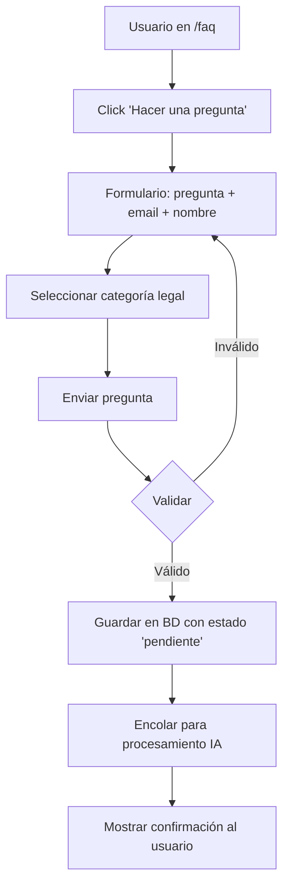
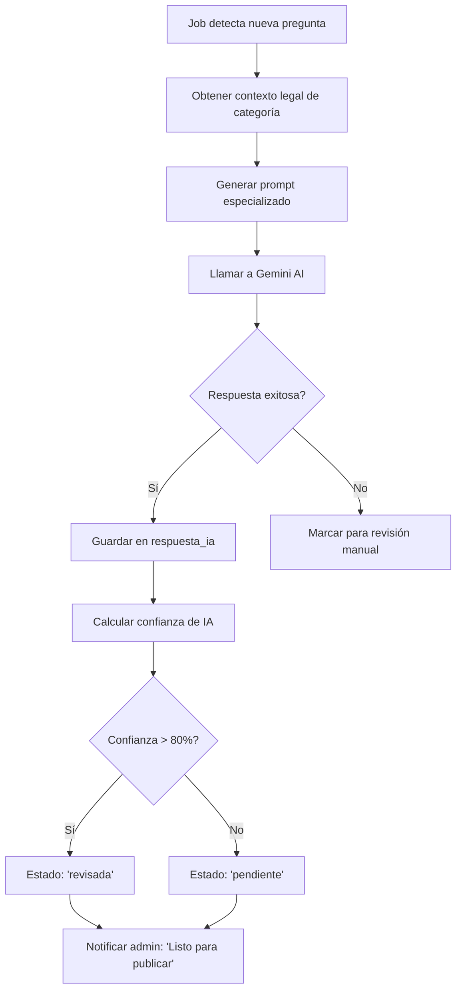
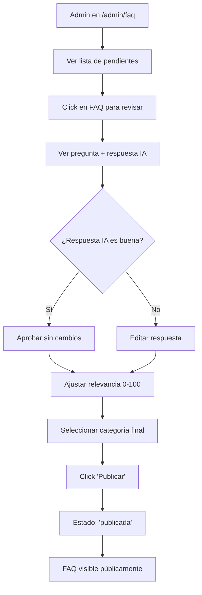
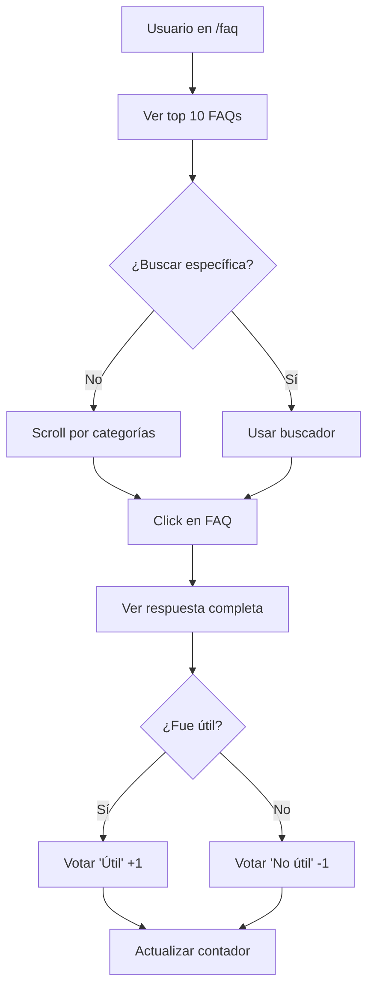

# 📋 Creación de Sistema de FAQ con IA

Voy a crear un sistema completo de FAQ (Preguntas Frecuentes) con integración de IA para procesamiento automático de respuestas y gestión administrativa.

---

## 📄 Paso 1: Crear Roadmap del Sistema FAQ

### roadmap3.md

```markdown
# 🗺️ Roadmap: Sistema de FAQ con IA

## 🎯 Visión General

Sistema completo de Preguntas Frecuentes (FAQ) que permite:
1. **Usuarios** envían preguntas desde formulario público
2. **IA (Gemini)** genera respuesta automática borrador
3. **Admin** revisa, edita y publica respuestas
4. **Sistema** muestra las 10 FAQ más relevantes públicamente
5. **Búsqueda inteligente** por texto y categorías

---

## 📊 Arquitectura del Sistema

### Base de Datos (Prisma Schema)

```prisma
// Tabla principal de FAQ
model FAQ {
  id              String   @id @default(uuid())
  pregunta        String   // Pregunta del usuario
  respuesta       String?  @db.Text // Respuesta final (admin)
  respuestaIA     String?  @db.Text // Borrador generado por IA
  categoria       String   // Categoría legal
  usuarioEmail    String?  // Email de quien pregunta (opcional)
  usuarioNombre   String?  // Nombre de quien pregunta (opcional)
  
  // Estados del flujo
  estado          String   @default("pendiente") // pendiente, revisada, publicada, rechazada
  
  // Relevancia y visibilidad
  relevancia      Int      @default(0) // Score de relevancia (0-100)
  vistas          Int      @default(0) // Contador de vistas
  votosUtiles     Int      @default(0) // Votos de "útil"
  publicada       Boolean  @default(false)
  
  // Procesamiento por IA
  procesadaPorIA  Boolean  @default(false)
  confianzaIA     Float?   // Confianza de la IA en la respuesta (0-1)
  
  // Gestión administrativa
  revisadaPor     String?  @db.Uuid // ID del admin que revisó
  revisor         User?    @relation(fields: [revisadaPor], references: [id])
  
  // Timestamps
  createdAt       DateTime @default(now())
  updatedAt       DateTime @updatedAt
  publicadaAt     DateTime? // Cuándo se publicó
  
  @@index([estado, publicada])
  @@index([relevancia, vistas])
  @@index([categoria])
  @@map("faqs")
}

// Votos de usuarios sobre FAQs
model FAQVote {
  id        String   @id @default(uuid())
  faqId     String
  userId    String?  @db.Uuid // Null si no está logueado
  ipAddress String   // Para evitar duplicados
  util      Boolean  // true = útil, false = no útil
  createdAt DateTime @default(now())
  
  @@unique([faqId, ipAddress])
  @@index([faqId])
  @@map("faq_votes")
}

// Búsquedas de usuarios (para mejorar relevancia)
model FAQSearch {
  id          String   @id @default(uuid())
  query       String
  resultados  Int      // Cuántos resultados se encontraron
  userId      String?  @db.Uuid
  ipAddress   String?
  createdAt   DateTime @default(now())
  
  @@index([query])
  @@map("faq_searches")
}
```

### Migración SQL

```sql
-- Agregar tablas de FAQ al schema existente

-- Tabla principal de FAQs
CREATE TABLE faqs (
  id UUID PRIMARY KEY DEFAULT gen_random_uuid(),
  pregunta TEXT NOT NULL,
  respuesta TEXT,
  respuesta_ia TEXT,
  categoria VARCHAR(100) NOT NULL,
  usuario_email VARCHAR(255),
  usuario_nombre VARCHAR(255),
  
  estado VARCHAR(50) DEFAULT 'pendiente',
  
  relevancia INTEGER DEFAULT 0,
  vistas INTEGER DEFAULT 0,
  votos_utiles INTEGER DEFAULT 0,
  publicada BOOLEAN DEFAULT false,
  
  procesada_por_ia BOOLEAN DEFAULT false,
  confianza_ia DECIMAL(3,2),
  
  revisada_por UUID REFERENCES users(id),
  
  created_at TIMESTAMPTZ DEFAULT NOW(),
  updated_at TIMESTAMPTZ DEFAULT NOW(),
  publicada_at TIMESTAMPTZ
);

-- Índices para performance
CREATE INDEX idx_faqs_estado_publicada ON faqs(estado, publicada);
CREATE INDEX idx_faqs_relevancia_vistas ON faqs(relevancia DESC, vistas DESC);
CREATE INDEX idx_faqs_categoria ON faqs(categoria);
CREATE INDEX idx_faqs_created ON faqs(created_at DESC);

-- Tabla de votos
CREATE TABLE faq_votes (
  id UUID PRIMARY KEY DEFAULT gen_random_uuid(),
  faq_id UUID NOT NULL REFERENCES faqs(id) ON DELETE CASCADE,
  user_id UUID REFERENCES users(id),
  ip_address VARCHAR(45) NOT NULL,
  util BOOLEAN NOT NULL,
  created_at TIMESTAMPTZ DEFAULT NOW(),
  
  UNIQUE(faq_id, ip_address)
);

CREATE INDEX idx_faq_votes_faq ON faq_votes(faq_id);

-- Tabla de búsquedas
CREATE TABLE faq_searches (
  id UUID PRIMARY KEY DEFAULT gen_random_uuid(),
  query TEXT NOT NULL,
  resultados INTEGER DEFAULT 0,
  user_id UUID REFERENCES users(id),
  ip_address VARCHAR(45),
  created_at TIMESTAMPTZ DEFAULT NOW()
);

CREATE INDEX idx_faq_searches_query ON faq_searches(query);
CREATE INDEX idx_faq_searches_created ON faq_searches(created_at DESC);
```

---

## 🔧 Estructura de Archivos

```
lib/
  └── faq/
      ├── faq.server.ts              [NUEVO] - CRUD de FAQs
      ├── faq-ia.server.ts           [NUEVO] - Procesamiento con IA
      ├── faq-relevancia.server.ts   [NUEVO] - Algoritmo de relevancia
      └── faq-busqueda.server.ts     [NUEVO] - Motor de búsqueda

app/
  ├── components/
  │   └── FAQ/
  │       ├── FAQList.tsx            [NUEVO] - Lista pública
  │       ├── FAQCard.tsx            [NUEVO] - Card individual
  │       ├── FAQSearch.tsx          [NUEVO] - Buscador
  │       ├── FAQForm.tsx            [NUEVO] - Formulario de envío
  │       ├── FAQVoteButton.tsx      [NUEVO] - Botón de votar
  │       └── AdminFAQQueue.tsx      [NUEVO] - Cola de admin
  ├── routes/
  │   ├── faq.tsx                    [NUEVO] - Página pública
  │   ├── faq.$id.tsx                [NUEVO] - FAQ individual
  │   ├── admin/
  │   │   ├── faq.tsx                [NUEVO] - Dashboard admin
  │   │   ├── faq.pendientes.tsx    [NUEVO] - Cola pendientes
  │   │   ├── faq.$id.editar.tsx    [NUEVO] - Editar FAQ
  │   │   └── faq.categorias.tsx    [NUEVO] - Gestión categorías
  │   └── api/
  │       └── faq/
  │           ├── submit.ts          [NUEVO] - Enviar pregunta
  │           ├── procesar-ia.ts     [NUEVO] - Procesar con IA
  │           ├── publicar.ts        [NUEVO] - Publicar FAQ
  │           ├── votar.ts           [NUEVO] - Votar útil/no útil
  │           ├── buscar.ts          [NUEVO] - Búsqueda
  │           └── stats.ts           [NUEVO] - Estadísticas
  └── styles/
      └── faq.css                    [NUEVO] - Estilos específicos
```

---

## 🎯 Flujo Completo del Sistema

### 1. Usuario Envía Pregunta (Formulario Público)



**Validaciones:**
- Pregunta mínimo 10 caracteres, máximo 500
- Email válido (opcional pero recomendado)
- Categoría debe existir en el sistema
- Rate limiting: Max 3 preguntas por IP por día

---

### 2. IA Procesa Automáticamente (Background Job)



**Prompt para IA:**
```typescript
const promptTemplate = `
Eres un asistente legal especializado en derecho colombiano.

CATEGORÍA: ${categoria}
PREGUNTA DEL USUARIO: ${pregunta}

INSTRUCCIONES:
1. Responde de forma clara y concisa (máximo 300 palabras)
2. Usa un tono profesional pero accesible
3. Cita normas específicas si aplica
4. NO des consejos legales específicos
5. Recomienda consultar abogado para casos específicos
6. Usa formato Markdown para estructura

FORMATO DE RESPUESTA:
## Respuesta Breve
[Párrafo inicial con respuesta directa]

## Normativa Aplicable
[Leyes o códigos relevantes]

## Consideraciones Importantes
[Puntos clave a tener en cuenta]

## Cuándo Consultar un Abogado
[Situaciones que requieren asesoría personalizada]

RESPONDE AHORA:
`;
```

---

### 3. Admin Revisa y Publica



**Panel de Admin debe mostrar:**
- Pregunta original
- Respuesta generada por IA (con indicador de confianza)
- Editor de texto enriquecido para editar
- Slider de relevancia (0-100)
- Selector de categoría
- Botones: Publicar / Rechazar / Guardar borrador

---

### 4. Usuario Ve FAQ Públicas



---

## 🧮 Algoritmo de Relevancia

```typescript
// Calcular relevancia de FAQ para ordenamiento
function calcularRelevancia(faq: FAQ): number {
  const PESO_VISTAS = 0.3;
  const PESO_VOTOS = 0.5;
  const PESO_RECIENTE = 0.2;
  
  // Normalizar vistas (max 1000 vistas = 100 puntos)
  const puntajeVistas = Math.min(faq.vistas / 10, 100) * PESO_VISTAS;
  
  // Votos útiles (cada voto = 1 punto, max 100)
  const puntajeVotos = Math.min(faq.votosUtiles, 100) * PESO_VOTOS;
  
  // Reciente (últimos 30 días = 100 puntos, decae linealmente)
  const diasDesdePublicacion = (Date.now() - faq.publicadaAt.getTime()) / (1000 * 60 * 60 * 24);
  const puntajeReciente = Math.max(0, 100 - (diasDesdePublicacion / 30 * 100)) * PESO_RECIENTE;
  
  return Math.round(puntajeVistas + puntajeVotos + puntajeReciente);
}
```

---

## 🔍 Motor de Búsqueda

### Características
- **Full-text search** en pregunta y respuesta
- **Filtros por categoría**
- **Ordenamiento** por relevancia, reciente, más visto
- **Sugerencias** basadas en búsquedas populares
- **Tracking** de búsquedas para mejorar FAQs

### Implementación

```typescript
// Búsqueda con PostgreSQL Full-Text Search
async function buscarFAQs(query: string, categoria?: string) {
  const resultados = await db.$queryRaw`
    SELECT 
      f.*,
      ts_rank(
        to_tsvector('spanish', f.pregunta || ' ' || f.respuesta),
        plainto_tsquery('spanish', ${query})
      ) as ranking
    FROM faqs f
    WHERE 
      f.publicada = true
      AND (
        to_tsvector('spanish', f.pregunta || ' ' || f.respuesta) @@ 
        plainto_tsquery('spanish', ${query})
      )
      ${categoria ? `AND f.categoria = ${categoria}` : ''}
    ORDER BY ranking DESC, f.relevancia DESC
    LIMIT 20
  `;
  
  // Registrar búsqueda para analytics
  await db.fAQSearch.create({
    data: {
      query,
      resultados: resultados.length,
      // ...
    }
  });
  
  return resultados;
}
```

---

## 📊 Estadísticas y Métricas

### Panel de Admin - Dashboard de FAQs

```typescript
interface FAQStats {
  total: number;
  publicadas: number;
  pendientes: number;
  procesadasPorIA: number;
  
  // Top performers
  masVistas: FAQ[];
  masUtiles: FAQ[];
  masRecientes: FAQ[];
  
  // Engagement
  totalVistas: number;
  totalVotos: number;
  tasaAprobacion: number; // % de votos útiles
  
  // Por categoría
  porCategoria: {
    nombre: string;
    cantidad: number;
    promedioVistas: number;
  }[];
  
  // Búsquedas
  busquedasTop: {
    query: string;
    cantidad: number;
  }[];
}
```

---

## 🎨 Componentes UI

### 1. Formulario Público (FAQForm.tsx)

```tsx
// Diseño minimalista editorial
- Campo de texto grande para pregunta (textarea)
- Selector de categoría con iconos
- Email y nombre opcionales
- Botón de envío destacado
- Mensaje de confirmación con animación
```

### 2. Lista Pública (FAQList.tsx)

```tsx
// Grid de cards estilo editorial
- Top 10 FAQs destacadas
- Tabs por categoría
- Buscador prominente
- Cards con:
  - Pregunta como título
  - Preview de respuesta (primeras 2 líneas)
  - Categoría con badge
  - Vistas y votos
  - Link "Ver respuesta completa"
```

### 3. Vista Individual (FAQ Detail)

```tsx
// Página completa estilo artículo
- Breadcrumb de navegación
- Pregunta como H1
- Categoría y metadata
- Respuesta con formato Markdown
- Botones de voto (útil/no útil)
- FAQs relacionadas
- Botón CTA "¿No resolvió tu duda? Habla con un abogado"
```

### 4. Panel Admin (AdminFAQQueue.tsx)

```tsx
// Dashboard administrativo
- Stats cards: pendientes, publicadas, procesadas
- Tabla con filtros y búsqueda
- Estados visuales con badges
- Confianza de IA con progress bar
- Acciones rápidas: editar, publicar, rechazar
```

---

## 🚀 Implementación por Fases

### Fase 1: Base de Datos y Backend (Día 1-2)
```bash
✅ Crear migración de tablas
✅ Implementar faq.server.ts (CRUD básico)
✅ Implementar faq-ia.server.ts (procesamiento)
✅ Testing de lógica de servidor
```

### Fase 2: Formulario Público y Vista (Día 3-4)
```bash
✅ Componente FAQForm con validación
✅ Página /faq con lista pública
✅ Componente FAQCard
✅ Vista individual /faq/$id
✅ Sistema de votos
```

### Fase 3: Procesamiento con IA (Día 5-6)
```bash
✅ Integración con Gemini para generar respuestas
✅ Sistema de confianza de IA
✅ Background job para procesamiento
✅ Notificaciones a admin cuando hay FAQs listas
```

### Fase 4: Panel Administrativo (Día 7-8)
```bash
✅ Dashboard de admin con stats
✅ Cola de pendientes con filtros
✅ Editor de FAQ con preview
✅ Sistema de publicación
✅ Gestión de categorías
```

### Fase 5: Búsqueda y Relevancia (Día 9-10)
```bash
✅ Implementar full-text search
✅ Algoritmo de relevancia
✅ Tracking de búsquedas
✅ Sugerencias automáticas
✅ FAQs relacionadas
```

### Fase 6: Optimización y Polish (Día 11-12)
```bash
✅ Caché de FAQs públicas
✅ Optimización de queries
✅ Animaciones y transiciones
✅ SEO optimization
✅ Testing end-to-end
```

---

## 📈 Métricas de Éxito

```typescript
// KPIs del sistema de FAQ
✅ Tasa de respuesta IA: > 80% de preguntas procesadas exitosamente
✅ Tasa de aprobación admin: > 70% de respuestas IA publicadas sin editar
✅ Engagement de usuarios: > 60% de FAQs votadas como útiles
✅ Reducción de carga a abogados: -30% de consultas repetitivas
✅ Tiempo de respuesta: < 24 horas desde pregunta hasta publicación
```

---

## 🎯 Categorías Legales Predefinidas

```typescript
const CATEGORIAS_FAQ = [
  { id: 'civil', nombre: 'Derecho Civil', icono: '📜' },
  { id: 'laboral', nombre: 'Derecho Laboral', icono: '💼' },
  { id: 'penal', nombre: 'Derecho Penal', icono: '⚖️' },
  { id: 'familia', nombre: 'Derecho de Familia', icono: '👨‍👩‍👧‍👦' },
  { id: 'contratos', nombre: 'Contratos', icono: '📝' },
  { id: 'propiedad', nombre: 'Propiedad e Inmuebles', icono: '🏠' },
  { id: 'comercial', nombre: 'Derecho Comercial', icono: '🏢' },
  { id: 'tributario', nombre: 'Derecho Tributario', icono: '💰' },
  { id: 'consumidor', nombre: 'Derechos del Consumidor', icono: '🛒' },
  { id: 'otros', nombre: 'Otros', icono: '📋' },
] as const;
```

---

## 🔐 Consideraciones de Seguridad

```typescript
// Rate limiting
- Envío de preguntas: 3 por IP por día
- Votos: 1 por FAQ por IP (único)
- Búsquedas: 20 por minuto por IP

// Validación
- Sanitizar todas las preguntas (XSS)
- Validar longitud de textos
- Verificar email con regex
- Bloquear spam con keywords

// Privacidad
- Email del usuario NO es público
- Solo admin ve email
- Opción de pregunta anónima
```

---

## 💡 Mejoras Futuras (Post-MVP)

```typescript
// V2 Features
- ✨ Traducción automática a otros idiomas
- ✨ Transcripción de audio para preguntas habladas
- ✨ Sistema de tags automáticos con IA
- ✨ Recomendación de abogados especialistas por pregunta
- ✨ Notificaciones email cuando se responde tu pregunta
- ✨ Exportación de FAQs en PDF
- ✨ Widget embebible para otras páginas
```

---

## 🎉 Entregable Final

Al completar este roadmap:

✅ **Usuarios tendrán:**
- Formulario intuitivo para enviar preguntas
- Acceso a las 10 FAQs más relevantes
- Buscador potente por texto y categoría
- Sistema de votos para marcar utilidad
- Vista detallada de cada FAQ

✅ **IA procesará:**
- Respuestas automáticas con contexto legal
- Score de confianza de cada respuesta
- Categorización automática
- Sugerencias de mejora

✅ **Admins podrán:**
- Revisar cola de preguntas pendientes
- Editar respuestas generadas por IA
- Publicar o rechazar FAQs
- Ver estadísticas completas
- Gestionar categorías

✅ **Sistema proporcionará:**
- Reducción de carga a abogados
- Base de conocimiento creciente
- Mejor SEO con contenido único
- Datos para mejorar IA legal

---

**Estado:** 📋 ROADMAP COMPLETO - LISTO PARA IMPLEMENTACIÓN

**Estimación total:** 12 días de desarrollo

**Prioridad:** 🔥 ALTA - Mejora significativa de UX y reduce carga operativa
```